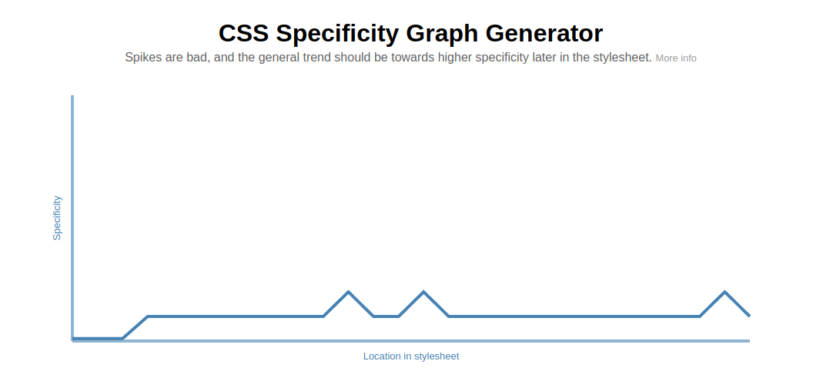

<div align="center">

#


</div>

<div align="center">

[](https://skillicons.dev)

<p>
    <a href="https://jigsaw.w3.org/css-validator/check/referer">
        
    </a>
</p>

</div>

# Interactive Rating Component

- [About the project](#about-the-project)
  - [Deploy](#deploy)
  - [See in your code editor](#see-in-your-code-editor)
  - [Edit in your code editor](#edit-in-your-code-editor)
- [Architectures](#architectures)
  - [ITCSS](#itcss)
- [Metodologies](#metodologies)
  - [SUITCSS](#suitcss)
- [CSS Specificity](#css-specificity)
- [Tools](#tools)
  - [Jira](#jira)
  - [SASS](#sass)
  - [SassDoc](#sassdoc)
  - [Babel](#babel)
  - [JsDoc](#jsdoc)
  - [Webpack](#webpack)

## About the project

### Deploy

This project is deployed in [Github Pages](https://pages.github.com/), click on the link below to see it in action:

- [Interactive Rating Component](https://nikolaikoz.github.io/FrontendMentor_Interactive_Rating_Component.github.io/)

### See in your code editor

- First, copy the repository link:
- Then, open your terminal and run the following command:

```bash
git clone https://github.com/NikolaiKoz/FrontendMentor_Interactive_Rating_Component.github.io.git
```

- Finally, open the project in your code editor and open the index.html in the root folder file with your browser, with the Live Server extension.

- Give it a star ⭐ if you like it!

### Edit in your code editor

- First, copy the repository link:
- Then, open your terminal and run the following command:

```bash
git clone https://github.com/NikolaiKoz/FrontendMentor_Interactive_Rating_Component.github.io.git
```

- Finally, open the project in your code editor and install the dependencies with the following command:

```bash
npm install
```

- Then, can edit the project in your code editor, run the following command to see the changes in your browser, with the Live Server extension.

```bash
npm run run
```

- Don't forget to document your code with JsDoc and SassDoc, run the following command to see the changes in your browser, with the Live Server extension.

```bash
npm run run
```

- Give it a star ⭐ if you like it!

#

- This is a nice, small project to practice handling user interactions and updating the DOM. It is a simple project to implement the new technologies that I am learning in a single project.

<div align="center">

|                                   Movile first 375px                                    |                                      Desktop 1440px                                      |
| :-------------------------------------------------------------------------------------: | :--------------------------------------------------------------------------------------: |
|           |          |
|  |  |

|                                  Active state                                   |
| :-----------------------------------------------------------------------------: |
|  |

</div>

- [x] Jira
- [x] SASS
- [x] SuitCSS
- [x] ITCSS
- [x] Sassdoc
- [x] Babel
- [x] Jsdoc
- [x] Webpack

#

## Architectures

### ITCSS

- **ITCSS** (Inverted Triangle CSS) is a methodology for organizing and naming **style files and folders in a web development project**. The main idea behind ITCSS is to build a logical hierarchy for styles, in such a way that the most specific and generic styles are at the bottom of the hierarchy.

According to the ITCSS methodology, the main styles file should be called "main.scss" and different folders should be created inside the "src/styles" folder to organize the styles into different categories. For example, you might have a folder for global styles, a folder for component styles, a folder for font styles, and so on.

As for creating folders with the same name as scss files, it is not necessary to follow the ITCSS methodology. The idea is that styles are organized into folders based on their level of specificity and not necessarily based on file names. For example, you could have a "buttons.scss" file inside the "components" folder and a "forms.scss" file inside the "components" folder, instead of creating a "buttons" folder and a "forms" folder. . ".

- Here I present an example of a folder scheme that you could use following the ITCSS methodology:

* 📁 src

  - 📁 scss

    - 📁 01-settings
      - 📄 \_colors.scss
      - 📄 \_typography.scss
    - 📁 02-tools
      - 📄 \_functions.scss
      - 📄 \_mixins.scss
    - 📁 03-generic
      - 📄 \_reset.scss
      - 📄 \_normalize.scss
    - 📁 04-elements
      - 📄 \_button.scss
      - 📄 \_form.scss
    - 📁 05-objects
      - 📄 \_layout.scss
      - 📄 \_grid.scss
    - 📁 06-components
      - 📄 \_header.scss
      - 📄 \_footer.scss
    - 📁 07-utilities

      - 📄 \_display.scss
      - 📄 \_text-align.scss

    - 📄 main.scss

* 📁 dist
  - 📁 css
    - 📄 main.css

- **This scheme consists of several folders with different categories of styles:**

  - The "settings" folder includes files with variables for colors and fonts.
  - The "tools" folder includes files with functions and mixins.
  - The "generic" folder includes files with generic styles, such as reset and normalize.
  - The "elements" folder contains files with styles for common HTML elements, such as buttons and forms.
  - The "objects" folder includes files with styles for layout objects, such as layout and grid.
  - The "components" folder contains files with styles for UI components, such as the header and footer.
  - The "utilities" folder includes files with utility styles, such as display and text alignment.
  - The "main.scss" file is the main file that is used to import all other style files.
  - It is important to note that this is just an example and you can modify it according to your needs.
  - The main idea is to follow the logical hierarchy of ITCSS and to organize its styles in a clear and coherent way.
  - All imported files in main.scss will be compiled and transformed into a single main.css file

* [x] <a href="https://developer.helpscout.com/seed/glossary/itcss/#:~:text=ITCSS%20is%20a%20CSS%20architecture%20created%20by%20Harry%20Roberts.&text=It's%20a%20modern%2C%20and%20very,as%20an%20upside%2Ddown%20triangle." title="it css architecture" target="_blank">IT CSS architecture</a>

#

## Methodologies

### SuitCSS

- **SUITCSS** is a methodology for **writing and organizing Cascading Styles (CSS)** in a consistent and modular way. It is based on a few key ideas:

* Class names must be explicit and specific.

- Styles must be bound to a specific component.
- Styles should be reusable and modular.
- With SUITCSS, a naming convention is usually followed that includes the name of the component and a description of the style. For example, a style for a button might have a name like "Btn--primary".

SUITCSS also promotes creating separate style files for each component, rather than having a monolithic file with all the styles in the project. In this way, the styles of each component can be reused in different contexts and the modularity and scalability of the project is maintained.

Regarding the organization of the style files and folders, SUITCSS does not have a specific folder scheme, but focuses more on the naming convention and the creation of files for each component. However, you can use any folder scheme that works for you to organize your styles in a logical and coherent way.

**Example SUITCSS methodology:**

.MyComponent {}

.MyComponent.is-animating {}

.MyComponent--modifier {}

.MyComponent-part {}

.MyComponent-anotherPart {}

- [x] <a href="https://github.com/suitcss/suit/blob/master/doc/naming-conventions.md" title="suit css documentation" target="_blank">SUIT CSS naming conventions</a>

#

### CSS Specificity

- **CSS specificity** is a set of rules that determines which CSS rules apply to a given element. It is based on the number of selectors in a rule and the specificity of each selector. The more specific a selector is, the higher its specificity will be.

- **The specificity of a selector is calculated as follows:**

  - Inline styles have a specificity of 1000.
  - IDs have a specificity of 100.
  - Classes, attributes and pseudo-classes have a specificity of 10.
  - Elements and pseudo-elements have a specificity of 1.

<div align="center">

|                               My graph                              |
| :------------------------------------------------------------------: |
|  |

</div>

- [x] <a href="https://developer.mozilla.org/en-US/docs/Web/CSS/Specificity" title="css specificity docs" target="_blank">CSS specificity docs</a>

- [x] <a href="https://jonassebastianohlsson.com/specificity-graph/" title="css specificity graph generator" target="_blank">CSS specificity graph generator</a>


#

## Tools

### Jira

- JiRA is a project management tool that allows you to plan, track, and manage your software development projects. It is used by software teams around the world to manage their projects and tasks.

For this project I use it together with agile methodologies to organize my programming springs.

<div align="center">

|                               My board                               |
| :------------------------------------------------------------------: |
|  |

</div>

### SASS

- SASS is a CSS preprocessor that allows you to use variables, nested rules, mixins, functions, and other features that do not exist in CSS. It also helps to keep things organized and allows you to create styles that are more DRY and maintainable.

- [x] <a href="https://sass-lang.com/" title="sass documentation" target="_blank">SASS documentation</a>

### SassDoc

- SassDoc is a tool for generating documentation for Sass projects. It allows you to create a documentation website for your project with a single command.

**See my Sass documentation** <a href="https://nikolaikoz.github.io/FrontendMentor_Interactive_Rating_Component.github.io/sassdoc/index.html" title="sass documentation" target="_blank">here</a>

- [x] <a href="http://sassdoc.com/" title="sass documentation" target="_blank">SassDoc documentation</a>

### Babel

- Babel is a JavaScript compiler that allows you to use the latest JavaScript features in your projects. It is used to convert ECMAScript 2015+ code into a backwards compatible version of JavaScript that can be run by older JavaScript engines.

- [x] <a href="https://babeljs.io/" title="babel documentation" target="_blank">Babel documentation</a>

### Webpack

- Webpack is a module bundler that allows you to bundle JavaScript files for usage in a browser. It also allows you to use loaders to preprocess files and you can add plugins to perform a wider variety of tasks.

- [x] <a href="https://webpack.js.org/" title="webpack documentation" target="_blank">Webpack documentation</a>

### JsDoc

- JsDoc is a tool for generating documentation for JavaScript projects. It allows you to create a documentation website for your project with a single command.

**See my documentation** <a href="https://nikolaikoz.github.io/FrontendMentor_Interactive_Rating_Component.github.io/docs/index.html" title="jsdoc documentation" target="_blank">here</a>

- [x] <a href="https://jsdoc.app/" title="jsdoc documentation" target="_blank">JsDoc documentation</a>

#
